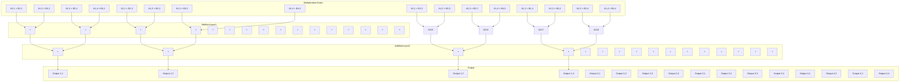

# Basic Flowchart

```mermaid
graph TD
    subgraph Output
        O11[Output 1,1]
        O12[Output 1,2]
        O13[Output 1,3]
        O14[Output 1,4]
        O21[Output 2,1]
        O22[Output 2,2]
        O23[Output 2,3]
        O24[Output 2,4]
        O31[Output 3,1]
        O32[Output 3,2]
        O33[Output 3,3]
        O34[Output 3,4]
        O41[Output 4,1]
        O42[Output 4,2]
        O43[Output 4,3]
        O44[Output 4,4]
    end

    subgraph AdditionLayer2
        A111["+"]
        A112["+"]
        A113["+"]
        A114["+"]
        A121["+"]
        A122["+"]
        A123["+"]
        A124["+"]
        A131["+"]
        A132["+"]
        A133["+"]
        A134["+"]
        A141["+"]
        A142["+"]
        A143["+"]
        A144["+"]
    end

    subgraph AdditionLayer1
        A211["+"]
        A212["+"]
        A213["+"]
        A214["+"]
        A221["+"]
        A222["+"]
        A223["+"]
        A224["+"]
        A231["+"]
        A232["+"]
        A233["+"]
        A234["+"]
        A241["+"]
        A242["+"]
        A243["+"]
        A244["+"]
    end

    subgraph MultiplicationGates
        M111["A1,1 × B1,1"]
        M112["A1,1 × B1,2"]
        M113["A1,1 × B1,3"]
        M114["A1,1 × B1,4"]
        M121["A1,2 × B2,1"]
        M122["A1,2 × B2,2"]
        M123["A1,2 × B2,3"]
        M124["A1,2 × B2,4"]
        M131["A1,3 × B3,1"]
        M132["A1,3 × B3,2"]
        M133["A1,3 × B3,3"]
        M134["A1,3 × B3,4"]
        M141["A1,4 × B4,1"]
        M142["A1,4 × B4,2"]
        M143["A1,4 × B4,3"]
        M144["A1,4 × B4,4"]
    end

    %% Connections for first row outputs
    M111 & M121 --> A211
    M131 & M141 --> A212
    A211 & A212 --> A111 --> O11

    M112 & M122 --> A213
    M132 & M142 --> A214
    A213 & A214 --> A112 --> O12

    M113 & M123 --> A215
    M133 & M143 --> A216
    A215 & A216 --> A113 --> O13

    M114 & M124 --> A217
    M134 & M144 --> A218
    A217 & A218 --> A114 --> O14

    %% Note: Only showing first row for clarity
    %% Similar connections exist for other rows
```

