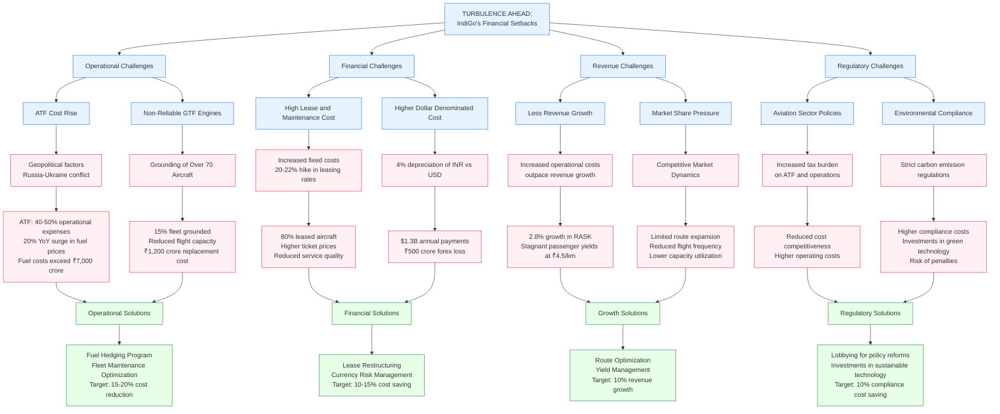
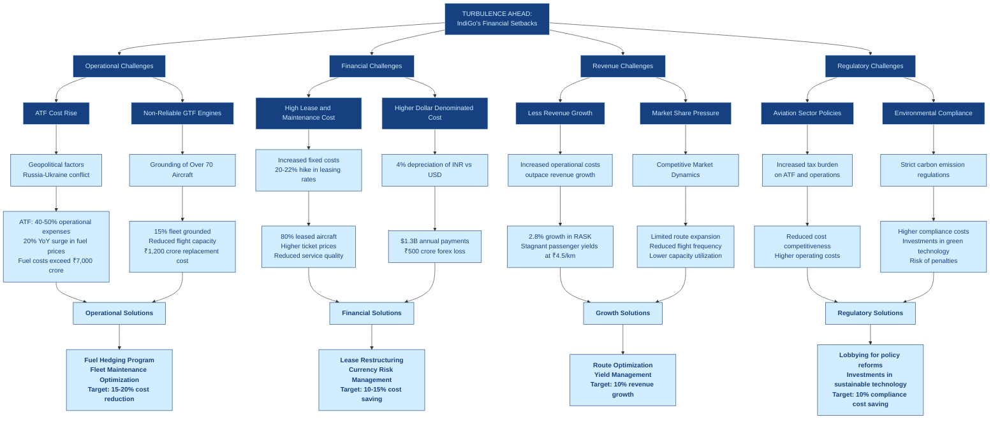
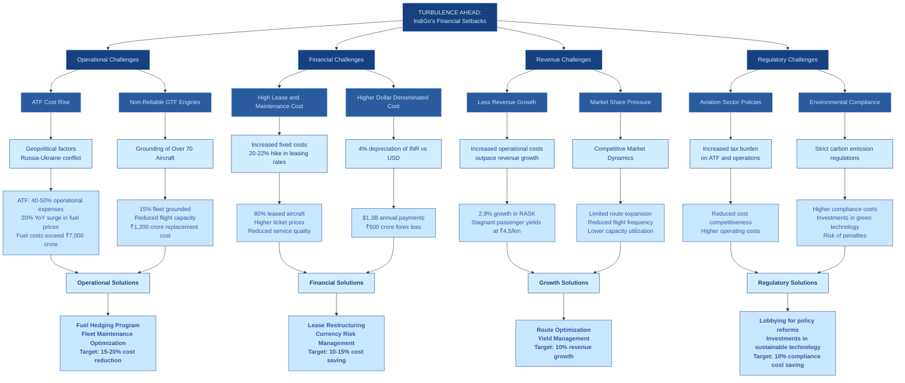

```mermaid
flowchart TD
    classDef challenge fill:#e6f3ff,stroke:#2d7de6
    classDef impact fill:#fff0f3,stroke:#e63946
    classDef solution fill:#e6ffe6,stroke:#2d8659

    A[TURBULENCE AHEAD:<br>IndiGo's Financial Setbacks]

    %% Branch 1: Operational Challenges
    A --> B[Operational Challenges]
    B --> B1[ATF Cost Rise]
    B --> B2[Non-Reliable GTF Engines]
    
    B1 --> B1A[Geopolitical factors<br>Russia-Ukraine conflict]
    B1A --> B1B[ATF: 40-50% operational expenses<br>20% YoY surge in fuel prices<br>Fuel costs exceed ₹7,000 crore]
    
    B2 --> B2A[Grounding of Over 70 Aircraft]
    B2A --> B2B[15% fleet grounded<br>Reduced flight capacity<br>₹1,200 crore replacement cost]

    %% Branch 2: Financial Challenges
    A --> C[Financial Challenges]
    C --> C1[High Lease and Maintenance Cost]
    C --> C2[Higher Dollar Denominated Cost]
    
    C1 --> C1A[Increased fixed costs<br>20-22% hike in leasing rates]
    C1A --> C1B[80% leased aircraft<br>Higher ticket prices<br>Reduced service quality]
    
    C2 --> C2A[4% depreciation of INR vs USD]
    C2A --> C2B[$1.3B annual payments<br>₹500 crore forex loss]

    %% Branch 3: Revenue Challenges
    A --> D[Revenue Challenges]
    D --> D1[Less Revenue Growth]
    D --> D2[Market Share Pressure]
    
    D1 --> D1A[Increased operational costs<br>outpace revenue growth]
    D1A --> D1B[2.8% growth in RASK<br>Stagnant passenger yields at ₹4.5/km]
    
    D2 --> D2A[Competitive Market Dynamics]
    D2A --> D2B[Limited route expansion<br>Reduced flight frequency<br>Lower capacity utilization]

    %% Branch 4: Regulatory Challenges
    A --> E[Regulatory Challenges]
    E --> E1[Aviation Sector Policies]
    E --> E2[Environmental Compliance]
    
    E1 --> E1A[Increased tax burden<br>on ATF and operations]
    E1A --> E1B[Reduced cost competitiveness<br>Higher operating costs]
    
    E2 --> E2A[Strict carbon emission regulations]
    E2A --> E2B[Higher compliance costs<br>Investments in green technology<br>Risk of penalties]

    %% Solutions Layer
    B1B & B2B --> S1[Operational Solutions]
    S1 --> S1A[Fuel Hedging Program<br>Fleet Maintenance Optimization<br>Target: 15-20% cost reduction]

    C1B & C2B --> S2[Financial Solutions]
    S2 --> S2A[Lease Restructuring<br>Currency Risk Management<br>Target: 10-15% cost saving]

    D1B & D2B --> S3[Growth Solutions]
    S3 --> S3A[Route Optimization<br>Yield Management<br>Target: 10% revenue growth]

    E1B & E2B --> S4[Regulatory Solutions]
    S4 --> S4A[Lobbying for policy reforms<br>Investments in sustainable technology<br>Target: 10% compliance cost saving]

    class A challenge
    class B,C,D,E challenge
    class B1,B2,C1,C2,D1,D2,E1,E2 challenge
    class B1A,B2A,C1A,C2A,D1A,D2A,E1A,E2A impact
    class B1B,B2B,C1B,C2B,D1B,D2B,E1B,E2B impact
    class S1,S2,S3,S4 solution
    class S1A,S2A,S3A,S4A solution
```

```mermaid
flowchart TD
    classDef challenge fill:#164080,stroke:#d2edff,color:#d2edff
    classDef impact fill:#d2edff,stroke:#164080,color:#164080
    classDef solution fill:#d2edff,stroke:#164080,color:#164080,font-weight:bold

    A[TURBULENCE AHEAD:<br>IndiGo's Financial Setbacks]

    %% Branch 1: Operational Challenges
    A --> B[Operational Challenges]
    B --> B1[ATF Cost Rise]
    B --> B2[Non-Reliable GTF Engines]
    
    B1 --> B1A[Geopolitical factors<br>Russia-Ukraine conflict]
    B1A --> B1B[ATF: 40-50% operational expenses<br>20% YoY surge in fuel prices<br>Fuel costs exceed ₹7,000 crore]
    
    B2 --> B2A[Grounding of Over 70 Aircraft]
    B2A --> B2B[15% fleet grounded<br>Reduced flight capacity<br>₹1,200 crore replacement cost]

    %% Branch 2: Financial Challenges
    A --> C[Financial Challenges]
    C --> C1[High Lease and Maintenance Cost]
    C --> C2[Higher Dollar Denominated Cost]
    
    C1 --> C1A[Increased fixed costs<br>20-22% hike in leasing rates]
    C1A --> C1B[80% leased aircraft<br>Higher ticket prices<br>Reduced service quality]
    
    C2 --> C2A[4% depreciation of INR vs USD]
    C2A --> C2B[$1.3B annual payments<br>₹500 crore forex loss]

    %% Branch 3: Revenue Challenges
    A --> D[Revenue Challenges]
    D --> D1[Less Revenue Growth]
    D --> D2[Market Share Pressure]
    
    D1 --> D1A[Increased operational costs<br>outpace revenue growth]
    D1A --> D1B[2.8% growth in RASK<br>Stagnant passenger yields at ₹4.5/km]
    
    D2 --> D2A[Competitive Market Dynamics]
    D2A --> D2B[Limited route expansion<br>Reduced flight frequency<br>Lower capacity utilization]

    %% Branch 4: Regulatory Challenges
    A --> E[Regulatory Challenges]
    E --> E1[Aviation Sector Policies]
    E --> E2[Environmental Compliance]
    
    E1 --> E1A[Increased tax burden<br>on ATF and operations]
    E1A --> E1B[Reduced cost competitiveness<br>Higher operating costs]
    
    E2 --> E2A[Strict carbon emission regulations]
    E2A --> E2B[Higher compliance costs<br>Investments in green technology<br>Risk of penalties]

    %% Solutions Layer
    B1B & B2B --> S1[Operational Solutions]
    S1 --> S1A[Fuel Hedging Program<br>Fleet Maintenance Optimization<br>Target: 15-20% cost reduction]

    C1B & C2B --> S2[Financial Solutions]
    S2 --> S2A[Lease Restructuring<br>Currency Risk Management<br>Target: 10-15% cost saving]

    D1B & D2B --> S3[Growth Solutions]
    S3 --> S3A[Route Optimization<br>Yield Management<br>Target: 10% revenue growth]

    E1B & E2B --> S4[Regulatory Solutions]
    S4 --> S4A[Lobbying for policy reforms<br>Investments in sustainable technology<br>Target: 10% compliance cost saving]

    class A challenge
    class B,C,D,E challenge
    class B1,B2,C1,C2,D1,D2,E1,E2 challenge
    class B1A,B2A,C1A,C2A,D1A,D2A,E1A,E2A impact
    class B1B,B2B,C1B,C2B,D1B,D2B,E1B,E2B impact
    class S1,S2,S3,S4 solution
    class S1A,S2A,S3A,S4A solution
```

```mermaid
flowchart TD
    %% Class Definitions
    classDef challengeLvl1 fill:#164080,stroke:#d2edff,color:#d2edff
    classDef challengeLvl2 fill:#2a5b9e,stroke:#c9e6ff,color:#c9e6ff
    classDef impactLvl1 fill:#d2edff,stroke:#164080,color:#164080
    classDef impactLvl2 fill:#c9e6ff,stroke:#2a5b9e,color:#2a5b9e
    classDef solutionLvl1 fill:#d2edff,stroke:#164080,color:#164080,font-weight:bold
    classDef solutionLvl2 fill:#c9e6ff,stroke:#2a5b9e,color:#2a5b9e,font-weight:bold

    %% Main Title
    A[TURBULENCE AHEAD:<br>IndiGo's Financial Setbacks]

    %% Branch 1: Operational Challenges
    A --> B[Operational Challenges]
    B --> B1[ATF Cost Rise]
    B --> B2[Non-Reliable GTF Engines]
    
    B1 --> B1A[Geopolitical factors<br>Russia-Ukraine conflict]
    B1A --> B1B[ATF: 40-50% operational expenses<br>20% YoY surge in fuel prices<br>Fuel costs exceed ₹7,000 crore]
    
    B2 --> B2A[Grounding of Over 70 Aircraft]
    B2A --> B2B[15% fleet grounded<br>Reduced flight capacity<br>₹1,200 crore replacement cost]

    %% Branch 2: Financial Challenges
    A --> C[Financial Challenges]
    C --> C1[High Lease and Maintenance Cost]
    C --> C2[Higher Dollar Denominated Cost]
    
    C1 --> C1A[Increased fixed costs<br>20-22% hike in leasing rates]
    C1A --> C1B[80% leased aircraft<br>Higher ticket prices<br>Reduced service quality]
    
    C2 --> C2A[4% depreciation of INR vs USD]
    C2A --> C2B[$1.3B annual payments<br>₹500 crore forex loss]

    %% Branch 3: Revenue Challenges
    A --> D[Revenue Challenges]
    D --> D1[Less Revenue Growth]
    D --> D2[Market Share Pressure]
    
    D1 --> D1A[Increased operational costs<br>outpace revenue growth]
    D1A --> D1B[2.8% growth in RASK<br>Stagnant passenger yields at ₹4.5/km]
    
    D2 --> D2A[Competitive Market Dynamics]
    D2A --> D2B[Limited route expansion<br>Reduced flight frequency<br>Lower capacity utilization]

    %% Branch 4: Regulatory Challenges
    A --> E[Regulatory Challenges]
    E --> E1[Aviation Sector Policies]
    E --> E2[Environmental Compliance]
    
    E1 --> E1A[Increased tax burden<br>on ATF and operations]
    E1A --> E1B[Reduced cost competitiveness<br>Higher operating costs]
    
    E2 --> E2A[Strict carbon emission regulations]
    E2A --> E2B[Higher compliance costs<br>Investments in green technology<br>Risk of penalties]

    %% Solutions Layer
    B1B & B2B --> S1[Operational Solutions]
    S1 --> S1A[Fuel Hedging Program<br>Fleet Maintenance Optimization<br>Target: 15-20% cost reduction]

    C1B & C2B --> S2[Financial Solutions]
    S2 --> S2A[Lease Restructuring<br>Currency Risk Management<br>Target: 10-15% cost saving]

    D1B & D2B --> S3[Growth Solutions]
    S3 --> S3A[Route Optimization<br>Yield Management<br>Target: 10% revenue growth]

    E1B & E2B --> S4[Regulatory Solutions]
    S4 --> S4A[Lobbying for policy reforms<br>Investments in sustainable technology<br>Target: 10% compliance cost saving]

    %% Class Assignments
    class A challengeLvl1
    class B,C,D,E challengeLvl1
    class B1,B2,C1,C2,D1,D2,E1,E2 challengeLvl2
    class B1A,B2A,C1A,C2A,D1A,D2A,E1A,E2A impactLvl1
    class B1B,B2B,C1B,C2B,D1B,D2B,E1B,E2B impactLvl2
    class S1,S2,S3,S4 solutionLvl1
    class S1A,S2A,S3A,S4A solutionLvl2
```
