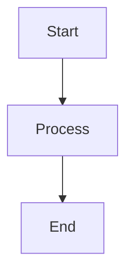

# Basic Flowchart


# Adding Multiple Nodes and Connections


# Different Node Shapes


# Subgraphs (Grouping)


# Sequence Diagram Example


# Class Diagram Example


# Gantt Chart Example


```mermaid
graph TD
    A[Clone Repository] --> B[Install Dependencies]
    B --> C[Run Tests]
    C --> D[Start Development]
    D --> E[Make Changes]
    E --> F[Commit]
    F --> G[Push]

### Bug Report Flow
```
```mermaid
graph LR
    A[Bug Found] --> B{Reproducible?}
    B -->|Yes| C[Create Issue]
    B -->|No| D[Gather More Info]
    C --> E[Add Labels]
    E --> F[Assign Developer]
